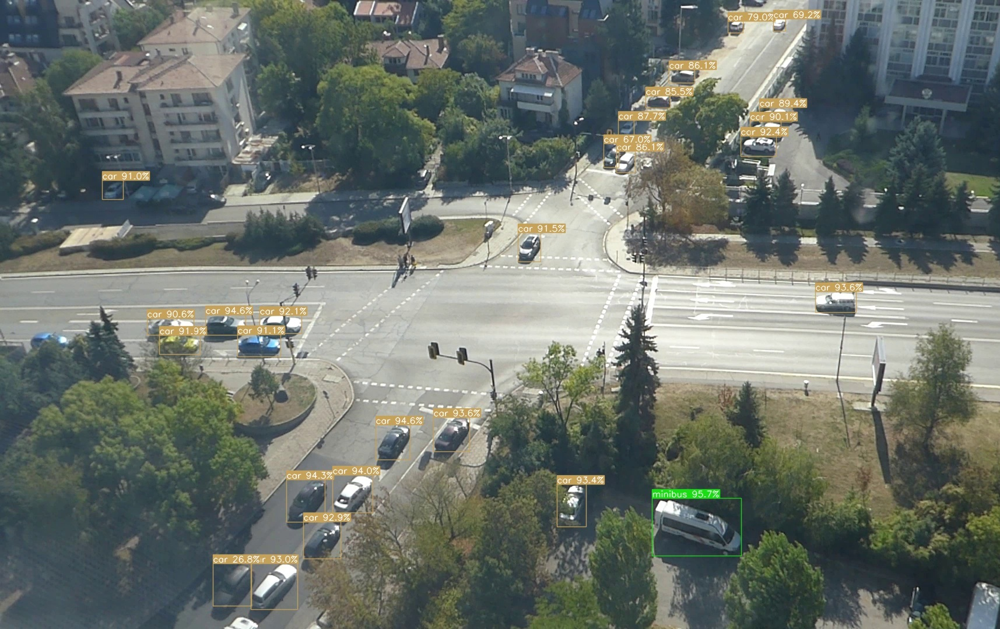
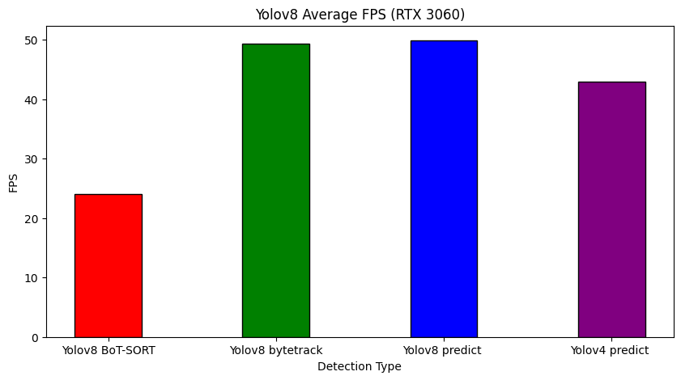

# TrafficDetection with Yolov8

Performance results of traffic detection and tracking with Yolov8

This test demonstrates the traffic detection and a short video of a crossroad with Yolov8 BoT-SORT and ByteTrack [See](https://docs.ultralytics.com/modes/track/)


. 
Video is with resolution (1920 x 1080), 10 seconds length and 25 FPS, taken with ordinary camera. This means that any FPS bigger that 25 is Ok for a realtime video stream processing with Yolov8.

The result is output video with same Full HD resolution (1920 x 1080) with bounding boxes and detection scores.


## Install Yolov8

First, install PyTorch with GPU support, and then ultralytics:

```python
pip install torch torchvision torchaudio --index-url https://download.pytorch.org/whl/cu118

pip install ultralytics
 
```

## Run the FPS test 

A small Yolov8 model (yolov8s.pt) is trained for 400 epochs with random frames of a longer video over six types of traffic vechicles:

```
                Class     Images  Instances      Box(P          R      mAP50  mAP50-95): 100%|██████████| 7/7 [00:03<0
                   all        105       3436      0.996       0.99      0.994      0.936
                   car        105       2976      0.996      0.962      0.989      0.914
                   bus        105         21          1      0.981      0.995      0.974
               minibus        105        203      0.998          1      0.995      0.992
                 truck        105         75      0.993          1      0.995      0.978
                   van        105        126      0.997          1      0.995      0.941
             motorbike        105         35      0.994          1      0.995      0.819
```
			 

## Display bounding boxes, class labels and condfidence scores 

Here is shown how to draw the output from the Yolov8 predict and track methods on the video frames. I have choosen several random colors for the bounding boxes.

```python
import numpy as np
import cv2

def drawBox(image, box, label='', color=(128, 128, 128), txt_color=(255, 255, 255)):
  (x,y), (w,h) = (int(box[0]), int(box[1])), (int(box[2]), int(box[3]))
  cv2.rectangle(image, (x,y), (w,h), color, thickness=1, lineType=cv2.LINE_AA)
  if label:
    t_w, t_h = cv2.getTextSize(label, 0, 0.5, thickness=1)[0]  # text width, height
    outside = y - t_h >= 3

    (w,h) = x + t_w, y - t_h - 3 if outside else y + t_h + 3
    cv2.rectangle(image, (x,y), (w,h), color, -1, cv2.LINE_AA)  # filled
    
    cv2.putText(image,
                label, (x, y - 2 if outside else y + t_h + 2),
                cv2.FONT_HERSHEY_SIMPLEX,
                0.5,
                txt_color,
                thickness=1,
                lineType=cv2.LINE_AA)
                
                
def drawBoxes(image, boxes, labels=[], colors=[], score=True, conf=None):
  #Define labels
  if labels == []:
    labels = {0: u'car', 1: u'bus', 2: u'minibus',3: u'truck', 4: u'van', 5: u'motorbike'}
  #Define colors
  if colors == []:
    colors = [(89, 161, 197),(57,76,139),(19, 222, 24),(186, 55, 2),(167, 146, 11),(190, 76, 98), (139,71,93),(84,139,84)]
  
  #plot each boxes
  for box in boxes:
    #add score in label if score=True
    if score :
      label = labels[int(box[-1])] + " " + str(round(100 * float(box[-2]),1)) + "%"
    else :
      label = labels[int(box[-1])]
      
    #filter every box under conf threshold if conf threshold setted
    if conf is None or box[-2] > conf :
        # print(box)
        idx = int(box[-1]) % len(colors)
        color = colors[idx]
        drawBox(image, box, label, color)
```             


## Calculate FPS 

This is the main cycle processing the video, I use OpenCV for the input and output video streams. 
The output ia a video file with bounding boxes labels and scores, written to a file vid_res.mp4. 
Average FPS is calculated as FPS sum divided on frames number, it includes only the Yolov8 detection.

```python
# process a test video and prints average FPS
import math
import random
import os
import cv2
import numpy as np
import time
import argparse  
import configparser
from ultralytics import YOLO
import draw_boxes as Boxes

video_file = 'vid.mp4'
video_file_out = 'vid_res.mp4'
model = YOLO('best_m.pt')

vid = cv2.VideoCapture(video_file)
fps = int(round(vid.get(cv2.CAP_PROP_FPS)))
w = int(vid.get(cv2.CAP_PROP_FRAME_WIDTH))  # float
h = int(vid.get(cv2.CAP_PROP_FRAME_HEIGHT))
fourcc = cv2.VideoWriter_fourcc(*'mp4v')    
out_w = w
out_h = h  
out = cv2.VideoWriter(video_file_out, fourcc, fps, (out_w, out_h), True)

print( "image size: " , w, " x ", h)

np.set_printoptions(suppress=True)

frame = 0
average_fps = 0.0
while True:
    ret, img = vid.read()
    if not ret:
        break
        
    start = time.time()
    # output = model.track(img)
    # output = model.track(img, conf=0.25, tracker="bytetrack.yaml")
    output = model.predict(img, conf=0.25)
    end = time.time()
    
    frame = frame + 1
    fps = 1.0/(end-start)
    print("%.1f" % fps)
    
    average_fps += fps
    
    Boxes.drawBoxes( img, output[0].boxes.data, score=True)

    out.write(img)
    
print("Average FPS: %.1f" % (average_fps / frame) )

vid.release()
out.release()
```

Result frames:


<p align="center">
  
</p>


## Benchmark comparison


Performance results of <b>RTX 3060</b> are shown below. 
I obtained these results with running the test several times for each detection method (commented lines) and taking the maximal Average FPS:

<p align="center">
  
</p>

## Final Result

Here is the video output for detection without tracking:

https://github.com/antonmilev/TrafficDetection/assets/46096854/8c86490d-9ebd-4326-bf6b-a9bbbc15d955


